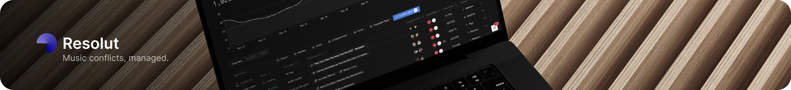

In today’s music industry, rights holders navigate a landscape of spreadsheets, email threads and dispersed metadata sources, which makes conflict resolution slow, error prone and expensive. Resolut provides a unified platform that centralizes every claim, document and data source in one secure workspace, eliminating operational silos and scaling with catalogs of any size . The platform integrates chain of title records and metadata with real time conflict monitoring to deliver clarity and control at every stage . Guided workflows automate routine tasks and audit logs record each action to ensure compliance readiness and reduce legal risk .

## ↓ Mission

Resolut was founded in Nashville in 2024 to solve the persistent challenge of manual music copyright conflict resolution . Where teams once toggled between multiple editing tools and email platforms to resolve disputes, Resolut offers a single source of truth. The platform supports configurable workflows, permission controls and real time alerts so that teams can react swiftly to new or recurring issues . Secure access controls and encrypted document storage protect sensitive legal records while preserving an immutable audit trail for every change .

## ↓ Key Benefits
	•	Centralized repository for catalog metadata and dispute documentation 
	•	Configurable resolution workflows that guide users from claim intake to final agreement 
	•	Real time notifications for conflict updates and pending actions 
	•	Auditable chain of title and version history for full transparency 

## ↓ Culture and Team -  [Get in Touch](https://www.resolut.media/)

Our team combines expertise in software engineering, music administration and data management to deliver a platform built for rights holders and industry professionals. We value collaboration, precision and a user first approach in everything we build .

## ↓ More Info

We're in closed beta and selectively onboarding rights holders, labels, and integration partners. To learn more or request access, visit:
https://www.resolut.media/

© 2025 Resolut, LLC. All rights reserved.

